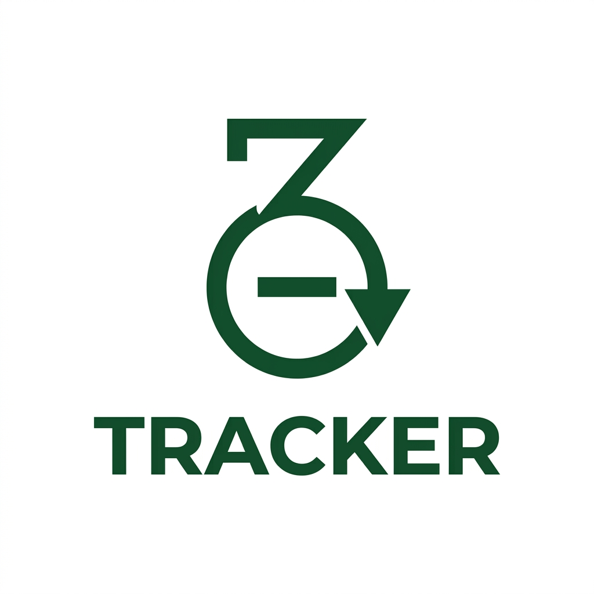

  
  <h1>ZeroTrack</h1>
  
<b>A Minimalist, Zero-Click Multi-Wallet Expense Tracker</b>

 

**ZeroTrack** is a fully automated, offline-first financial tracker that autonomously intercepts banking push notifications, determines if it's an income or expense, and logs it directly into a local multi-wallet database—zero clicks required.

## 🚀 Features

- **Zero-Click Automation:** Uses Android's Notification Listener Service to parse incoming banking alerts.
- **Universal Multi-Currency Engine:** Built to detect transactions globally (USD `$`, EUR `€`, GBP `£`, THB `฿`, MMK `Ks`, JPY `¥`, KRW `₩`, INR `₹`, MYR `RM`) and automatically assign them to their native wallets!
- **Isolated Multi-Wallet Dashboard:** Spend in Thai Baht and other currency simultaneously? ZeroTrack generates independent wallet tabs so your net balances never improperly mix.
- **100% Offline & Private:** No cloud servers. No API keys. Your financial data is securely locked inside a local Room/SQLite database on your device.
- **Minimalist Jetpack Compose UI:** Deep forest green aesthetics, dark/light mode, and seamless micro-interactions built entirely in Kotlin and Jetpack Compose.

---

## 📥 Installation & Sideloading (Important!)

Because ZeroTrack uses Android's powerful background automation to read banking alerts, **Google Play Protect will flag this app during sideloading.** This is a standard Android security mechanism for apps outside the official Play Store that request notification access.

**How to Install:**

1. Download **`ZeroTrack.apk`** from the [Releases](../../releases/latest) page.
2. Open the APK on your Android device.
3. When the Google Play Protect _"App blocked to protect your device"_ warning appears:
   - Click **More Details**
   - Click **Install Anyway**
4. Once installed, open ZeroTrack and grant the requested **Notification Access** so the automation engine can work!

_(Transparency Promise: ZeroTrack is fully open-source. You can inspect `ExpenseNotificationListener.kt` to verify that your data is only written to your local device database and is never transmitted over the internet)._

---

## 🏗️ Tech Stack

- **Language:** Kotlin
- **UI Framework:** Jetpack Compose (Material 3)
- **Architecture:** MVVM (Model-View-ViewModel)
- **Database:** Room (SQLite) + Kotlin Coroutines & Flows
- **Background Engine:** NotificationListenerService

---

## 🤝 Contributing

Feel free to open an issue or submit a pull request if you want to add support for specific bank parsers in your country!
